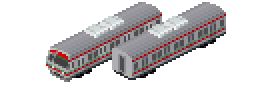
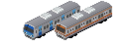

# 도시철도Set(都市鉄道(韓国)セット)
**v2.1.0以前からv2.1.1以降にアップデートする場合、v2.1.1に付属のcompat.tabを使用してください！**
## 更新履歴

### v2.2.0
- 311000系 1次車・2次車の旧塗装を追加しました。
- 341000系 1次車・2次車の旧塗装を追加しました。
- ソウルメトロ1000系1次車の最後尾車両の前照灯が点灯していたため尾灯点灯に修正しました。

### v2.1.1
- KORAIL 1000系の車番がエラーだったのを修正

### v2.1.0
- KORAIL 1000系を追加
- ソウルメトロ1000系の登場年を修正・グラフィックの微修正
- 連結相手のいない`Gal_seoulMetro_1300_RC_2nd(T)`の削除
- 331000系2次車の色を変更(実車が出てくる時に再度調整します。)
- 361000系2次車を追加

## 謝辞
きたきゅー様の各種アドオン、M_kasumi様のITX-青春より改造しました。

ライセンス - [CC BY-NC-SA](https://creativecommons.org/licenses/by-nc-sa/4.0/deed.ja)

主にソウル近辺の都市鉄道(首都圏電鉄)のアドオンです。現役車両を中心に実装しており、ある程度自由度のある組成が出来ます。

## 路線別アドオン解説

### 1호선(1号線)

KORAIL区間は交流、メトロ区間は直流のため10両編成は全車が交直両用車両です。

#### KORAIL 1000系
車番は改編前のものをベースにしています。
電動車ユニット・Tc・Tの単位で混ぜることが出来ます。
||登場時塗装|山型塗装|磁石塗装||
|:-:|:-:|:-:|:-:|:--|
|1次車 ( Gal_korail_1x00_1st )| 1974| 1995| 2005| 登場時の車両です。 磁石塗装時代には増結用の中間車しか残っていなかったようです。 |
|2次車 ( Gal_korail_1x00_2nd )| 1986| 1995| 2006| 前面デザインが変更になり、張り上げ屋根・扉窓が大窓になりました。 |
|3次車 ( Gal_korail_1x00_3rd )|| 1994| 2005| ナッチャギに通ずるデザインになりました。扉窓は小窓です。 |

| 1号車 | 2号車 | 3号車 | 4号車 | 5号車 | 6号車 | 7号車 | 8号車 | 9号車 | 10号車 | 備考 |
|:-:|:-:|:-:|:-:|:-:|:-:|:-:|:-:|:-:|:-:|:--|
|1000 (Tc1)|1300 (M1)|1600 (M2)|1100 (T)|1300 (M1)|1600 (M2)|1100 (T)|1300 (M1)|1600 (M2)|1000 (Tc2)| 基本編成 |
|1000 (Tc1)|1300 (M1)|1600 (M2)|1300 (M1)|1600 (M2)|1300 (M1)|1600 (M2)|1000 (Tc2)||| 8両 |
|1000 (Tc1)|1300 (M1)|1600 (M2)|1300 (M1)|1600 (M2)|1000 (Tc2)||||| 登場時 |

#### KORAIL 311000系
|||||
|:-:|:-:|:-:|:--|
|1次車 ( Gal_korail_311x00_1st )|1996~|| ナッチャギと呼ばれる顔の車両です。 4・7号車に1000系から転用したT車が組み込まれている編成がいました。|
|2次車 ( Gal_korail_311x00_2nd )|2002~|| トングリと呼ばれる顔の車両です。|
|3次車 ( Gal_korail_311x00_3rd )|2005~|| トングリや蛇の目と呼ばれる顔の車両です。|
|3.5次車 ( Gal_korail_311x00_3_5th )|2016~|| 上の車両のマイナーチェンジです。 前照灯が3つになったほか、パンタグラフが変更されています。|
|4次車 ( Gal_korail_311x00_4th )|2019~|| チュドゥンイと呼ばれる顔の車両です。 この車両もIGBT VVVFですが最近の車らしく運行コストを下げています。|
|4.5次車 ( Gal_korail_311x00_4_5th )|2021~|| チュドゥンイと呼ばれる顔の車両のマイナーチェンジです。 早々にキューブに移行してしまったため1号線では少数派です。|
|5次車 ( Gal_korail_311x00_5th )|2022~|| キューブと呼ばれている車両です。 アルミ塗装車体で現在も導入が進む世代の車両です。|
|319000系 ( Gal_korail_319x00_5th )|2009~|| 1次車の事故車を復旧した車両を再現しています。(4両編成ですが10両まで組めるようになっています) 3次車から改造した車両や4次車6両編成で新造され、水仁・盆唐線を走行する車両も319000系です。|
|311x90 (311B90)編成 ( Gal_korail_311x90_5th )|2012~||京春線の361000系から中央線を経て1号線に転用された編成です。 331000系と同じくアルミ無塗装車体ですが前面の塗り分けが361000系譲りとなっています。 転用元が8両なので増結用にステンレス車両が新造され組み込まれています。|

| 1号車 | 2号車 | 3号車 | 4号車 | 5号車 | 6号車 | 7号車 | 8号車 | 9号車 | 10号車 ||
|:-:|:-:|:-:|:-:|:-:|:-:|:-:|:-:|:-:|:-:|:--|
|311000 (Tc1)|311100 (M2)|311200 (M1)|311300 (T)|311200 (M1)|311500 (T2)|311300 (T)|311100 (M2)|311200 (M1)|311900 (Tc2)| 基本編成 |
|311000 (Tc1)|311100 (M2)|311200 (M1)|**311300_old (T)**|311200 (M1)|311500 (T2)|**311300_old (T)**|311100 (M2)|311200 (M1)|311900 (Tc2)| 旧型組み込み (1次車) |
|311000 (Tc1)|311100 (M2)|311200 (M1)|311300 (T)|**311400 (M1)**|**311500 (T2)**|311300 (T)|311100 (M2)|311200 (M1)|311900 (Tc2)| 311x90編成 **SUS車両** |
|319000 (Tc1)|319200 (M1)|319200 (M1)|319900 (Tc2)||||||| 光明シャトル |
|311000 (Tc1)|311100 (M2)|311200 (M1)|311300 (T)|311300 (T)|311100 (M2)|311200 (M1)|311900 (Tc2)||| 京義・中央線 (321000系) |
|311000 (Tc1)|311100 (M2)|311200 (M1)|311300 (T)|311200 (M1)|311900 (Tc2)||||| 水仁・盆唐線 (319000系) |

#### ソウルメトロ 1000系(抵抗)
電動車ユニット・Tc・Tの単位で混ぜることが出来ます。
|||||
|:-:|:-:|:-:|:--|
|初期車 (Gal_seoulMetro_1x00_RC_1st)|1974~|| 1974年登場当初の車両です。 初めは6両編成でしたが、10両編成へと増結されました|
|先頭化改造車 (Gal_seoulMetro_1x00_RC_2nd)|1999~|| 1999年に1989年製造の増結用中間車を先頭化改造した車両です ~~*アドオン上では1974年から使用できます。~~|
|事故復旧新造車 (Gal_seoulMetro_1x00_RC_3rd)|M,(T) 1999~ Tc 2004~|| 1999年に増結車だけで編成を組んだ際に不足する電動車が1999年に製造されました また、2004年に事故廃車分の補填として新造された車両です。(事故で廃車になった車両のうち2両は1999年製造でした) ドア窓が大窓になりました。 ~~*アドオン上では1974年から使用できます。~~|

| 1号車 | 2号車 | 3号車 | 4号車 | 5号車 | 6号車 | 7号車 | 8号車 | 9号車 | 10号車 | 備考 |
|:-:|:-:|:-:|:-:|:-:|:-:|:-:|:-:|:-:|:-:|:--|
|1000 (Tc1)|1100 (M1)|1200 (M2)|1300 (T)|1100 (M1)|1200 (M2)|1300 (T)|1100 (M1)|1200 (M2)|1900 (Tc2)| 基本編成 |
|1000 (Tc1)|1100 (M1)|1200 (M2)|1100 (M1)|1200 (M2)|1900 (Tc2)||||| 登場時 |
|1000_**2nd** (Tc1)|1100_**3rd** (M2)|1200_**3rd** (M1)|1300_1st (T)|1100_1st (M2)|1200_1st (M1)|1300_1st (T)|1100_**3rd** (M2)|1200_**3rd** (M1)|1900_**3rd** (Tc2)| 1011F (1999年新造車・事故復旧編成) |

#### ソウルメトロ 1000系(VVVF)
|||||
|:-:|:-:|:-:|:--|
|1次車 (Gal_seoulMetro_1x00_VF_1st)|1998~|| すべてのM車にパンタグラフが2基載ります。 4・7号車に1000系(抵抗)から転用したT車が組み込まれている編成がいます。 |

| 1号車 | 2号車 | 3号車 | 4号車 | 5号車 | 6号車 | 7号車 | 8号車 | 9号車 | 10号車 | 備考 |
|:-:|:-:|:-:|:-:|:-:|:-:|:-:|:-:|:-:|:-:|:--|
|1000 (Tc1)|1100 (M)|1100 (M)|1300 (T)|1100 (M)|1300 (T)|1300 (T)|1100 (M)|1100 (M)|1900 (Tc2)| 基本編成 |
|1000 (Tc1)|1100 (M)|1100 (M)|**1300_old (T)**|1100 (M)|1300 (T)|**1300_old (T)**|1100 (M)|1100 (M)|1900 (Tc2)| 旧型組み込み |

----

### 2호선(2号線)

#### ソウルメトロ 2000系(VVVF)
|||||
|:-:|:-:|:-:|:--|
|1次車 (Gal_seoulMetro_2x00_VF_1st)|2005~|| 10両編成と支線用4両編成があります。 |
|2次車 (Gal_seoulMetro_2x00_VF_2nd)|2007~|| 10両編成と支線用4両編成があります。 4・7号車に1000系(抵抗)から転用したT車が組み込まれている編成がいました。 |
|3次車 (Gal_seoulMetro_2x00_VF_3rd)|2017~|| 10両編成と支線用6両編成があり、2020以降にも投入されています |
|4次車 (Gal_seoulMetro_2x00_VF_4th)|2019~|| 10両編成と支線用4両編成があります。 |

| 1号車 | 2号車 | 3号車 | 4号車 | 5号車 | 6号車 | 7号車 | 8号車 | 9号車 | 10号車 | 備考 |
|:-:|:-:|:-:|:-:|:-:|:-:|:-:|:-:|:-:|:-:|:--|
|2000 (Tc1)|2100 (M2)|2200 (M1)|2300 (T)|2200 (M1)|1500 (T2)|2300 (T)|2100 (M2)|2200 (M1)|2900 (Tc2)| 基本編成 |
|2000 (Tc1)|2100 (M2)|2200 (M1)|**2300_old (T)**|2200 (M1)|1500 (T2)|**2300_old (T)**|2100 (M2)|2200 (M1)|2900 (Tc2)| 旧型組み込み (2次車) |
|2000 (Tc1)|2200 (M1)|2200 (M1)|2900 (Tc2)||||||| 支線用4両 |
|2000 (Tc1)|2100 (M2)|2200 (M1)|2300 (T)|2200 (M1)|2900 (Tc2)||||| 支線用6両 |

----

### 3호선(3号線)

KORAIL区間含め全線で直流です。KORAIL車は整備等をメトロに委託しているため例外的に4桁の車番のままになっています。

#### KORAIL 3000系
|||||
|:-:|:-:|:-:|:--|
|1次車 ( Gal_korail_3x00_1st )|1995~2024*|| ナッチャギと呼ばれる顔の車両ですがほかのナッチャギとは異なる顔です。(メトロ1000、4000と同じような顔) *2024年6月に引退しましたが引退設定をしていません。 |
|2次車 ( Gal_korail_3x00_2nd )|2022~|| チュドゥンイと呼ばれる顔の車両です。 この車両もIGBT VVVFですが最近の車らしく運行コストを下げています。 |
|3次車 ( Gal_korail_3x00_3rd )|2022~|| キューブと呼ばれている車両で、アルミ塗装車体です  |

| 1号車 | 2号車 | 3号車 | 4号車 | 5号車 | 6号車 | 7号車 | 8号車 | 9号車 | 10号車 | 備考 |
|:-:|:-:|:-:|:-:|:-:|:-:|:-:|:-:|:-:|:-:|:--|
|3000 (Tc1)|3100 (M2)|3200 (M1)|3300 (T)|3200 (M1)|3500 (T2)|3300 (T)|3100 (M2)|3200 (M1)|3900 (Tc2)| 基本編成 |

#### ソウルメトロ 3000系(VVVF)
|||||
|:-:|:-:|:-:|:--|
|1次車 ( Gal_seoulMetro_3x00_1st )|2009~|||
|2次車 ( Gal_seoulMetro_3x00_2nd )|2021~||この車両もIGBT VVVFですが最近の車らしく運行コストを下げています。|

| 1号車 | 2号車 | 3号車 | 4号車 | 5号車 | 6号車 | 7号車 | 8号車 | 9号車 | 10号車 | 備考 |
|:-:|:-:|:-:|:-:|:-:|:-:|:-:|:-:|:-:|:-:|:--|
|3000 (Tc1)|3100 (M2)|3200 (M1)|3300 (T)|3200 (M1)|3500 (T2)|3300 (T)|3100 (M2)|3200 (M1)|3900 (Tc2)| 基本編成 |

----

### 4호선(4号線)

1号線と同じくKORAIL区間は交流・メトロ区間は直流ですが、メトロ区間も距離が長いため、メトロ区間用の直流専用車両があります。

#### KORAIL 341000系
|||||
|:-:|:-:|:-:|:--|
|1次車 ( Gal_korail_311x00_1st )|1993~2023|| ナッチャギと呼ばれる顔の車両です。 *2023年に引退しましたが引退設定をしていません。|
|2次車 ( Gal_korail_311x00_2nd )|1999~|| トングリと呼ばれる顔の車両ですがナッチャギと車体・制御装置等は同一です。|
|4次車(Y型パンタグラフ) ( Gal_korail_311x00_4th_Ypt )|2019~|| チュドゥンイと呼ばれる顔の車両です。 Y型パンタグラフが2基搭載だった時期の仕様です。|
|4次車 ( Gal_korail_311x00_4th )|2019~|| 4号線で運用するにあたってY型パンタグラフ1基で問題があったため従来通りのパンタグラフになっています。 赤色で1号線に貸し出されていた車両もいます。 この車両もIGBT VVVFですが最近の車らしく運行コストを下げています。|
|4.5次車(Y型パンタグラフ) ( Gal_korail_311x00_4_5th_Ypt )|2021~|| チュドゥンイと呼ばれる顔の車両のマイナーチェンジです。 新造時のY型パンタグラフ搭載仕様です。|
|4.5次車 ( Gal_korail_311x00_4_5th )|2021~|| 現在も導入が進む世代の車両です。 最近まで1号線に貸し出されていました。|

| 1号車 | 2号車 | 3号車 | 4号車 | 5号車 | 6号車 | 7号車 | 8号車 | 9号車 | 10号車 ||
|:-:|:-:|:-:|:-:|:-:|:-:|:-:|:-:|:-:|:-:|:--|
|311000 (Tc1)|311100 (M2)|311200 (M1)|311300 (T)|311200 (M1)|311500 (T2)|311300 (T)|311100 (M2)|311200 (M1)|311900 (Tc2)| 基本編成 |

#### ソウルメトロ 4000系(VVVF)
|||||
|:-:|:-:|:-:|:--|
|1次車 (Gal_seoulMetro_4x00_1st)|1993~|| すべてのM車にパンタグラフが2基載ります。 |
|1次車(直流車) (Gal_seoulMetro_4x00_1st_DC)|1994~|| すべてのM車にパンタグラフが2基載ります。 メトロ区間用の直流車両です。 |
|2次車 (Gal_seoulMetro_4x00_2nd)|2020~|| 延伸時に増備された4080番台の編成です。 この車両もIGBT VVVFですが最近の車らしく運行コストを下げています。 |
|3次車 (Gal_seoulMetro_4x00_3rd)|2023~||  |
|4次車(直流車) (Gal_seoulMetro_4x00_4th)|2024~|| メトロ区間用の直流車両です。 |

| 1号車 | 2号車 | 3号車 | 4号車 | 5号車 | 6号車 | 7号車 | 8号車 | 9号車 | 10号車 | 備考 |
|:-:|:-:|:-:|:-:|:-:|:-:|:-:|:-:|:-:|:-:|:--|
|4000 (Tc1)|4100 (M)|4100 (M)|4300 (T)|4100 (M)|4300 (T)|4300 (T)|4100 (M)|4100 (M)|4900 (Tc2)| 基本編成 (1次車) |
|4000 (Tc1)|4100 (M2)|4200 (M1)|4300 (T)|4200 (M1)|4500 (T2)|4300 (T)|4100 (M2)|4200 (M1)|4900 (Tc2)| 基本編成 (2次車以降) |

----

### 5호선(5号線)

#### ソウルメトロ 5000系(VVVF)
|||||
|:-:|:-:|:-:|:--|
|1次車 ( Gal_seoulMetro_5x00_1st )|1994~|| ソウル特別市交通公社の標準的な車両です。 |
|2次車 ( Gal_seoulMetro_5x00_2nd )|2018~|||
|3次車 ( Gal_seoulMetro_5x00_3rd )|2021~|||

| 1号車 | 2号車 | 3号車 | 4号車 | 5号車 | 6号車 | 7号車 | 8号車 | 備考 |
|:-:|:-:|:-:|:-:|:-:|:-:|:-:|:-:|:--|
|5100 (Tc1)|5200 (M2)|5300 (M1)|5400 (T)|5500 (T)|5200 (M2)|5300 (M1)|5000 (Tc2)| 基本編成 |
|311000 (Tc1)|311100 (M2)|311200 (M1)|311300 (T)|311200 (M1)|311500 (T2)|311300 (T)|311100 (M2)|311200 (M1)|311900 (Tc2)| 基本編成 |
----

### 6호선(6号線)

#### ソウルメトロ 6000系(VVVF)
|||||
|:-:|:-:|:-:|:--|
|1次車 ( Gal_seoulMetro_6x00_1st )|1999~|| ソウル特別市交通公社の標準的な車両です。 |

| 1号車 | 2号車 | 3号車 | 4号車 | 5号車 | 6号車 | 7号車 | 8号車 | 備考 |
|:-:|:-:|:-:|:-:|:-:|:-:|:-:|:-:|:--|
|6100 (Tc1)|6200 (M2)|6300 (M1)|6400 (T)|6500 (T)|6200 (M2)|6300 (M1)|6000 (Tc2)| 基本編成 |

----

### 7호선(7号線)

#### ソウルメトロ 7000系(VVVF)
|||||
|:-:|:-:|:-:|:--|
|1次車(旧塗装) ( Gal_seoulMetro_7x00_1st_old )|1995~|| ソウル特別市交通公社の標準的な車両です。 |
|1次車 ( Gal_seoulMetro_7x00_1st )|2000~|| 帯デザインが2次車と同じデザインに変更された仕様です。 |
|2次車 ( Gal_seoulMetro_7x00_2nd )|1999~|| ビートレス車体になり、帯のデザインも変更されました。 |
|4次車 ( Gal_seoulMetro_7x00_4th )|2020~|||
|5次車 ( Gal_seoulMetro_7x00_5th )|2021~|||

| 1号車 | 2号車 | 3号車 | 4号車 | 5号車 | 6号車 | 7号車 | 8号車 | 備考 |
|:-:|:-:|:-:|:-:|:-:|:-:|:-:|:-:|:--|
|7100 (Tc1)|7200 (M2)|7300 (M1)|7400 (T)|7500 (T)|7200 (M2)|7300 (M1)|7000 (Tc2)| 基本編成 |

#### ソウルメトロ SR000系
|||||
|:-:|:-:|:-:|:--|
|3次車 ( Gal_seoulMetro_7x00_SR000 )|2021~|| 3次車という扱いを受けることもあるようです。 延伸区間の発注元の都合でSR000系となっていますが7000番台の連番になっています。 |

| 1号車 | 2号車 | 3号車 | 4号車 | 5号車 | 6号車 | 7号車 | 8号車 | 備考 |
|:-:|:-:|:-:|:-:|:-:|:-:|:-:|:-:|:--|
|7100 (Tc1)|7200 (M2)|7300 (M1)|7400 (T)|7500 (T)|7200 (M2)|7300 (M1)|7000 (Tc2)| 基本編成 |

----

### 8호선(8号線)

#### ソウルメトロ 8000系(VVVF)
|||||
|:-:|:-:|:-:|:--|
|1次車(旧塗装) ( Gal_seoulMetro_8x00_1st_old )|1995~|| ソウル特別市交通公社の標準的な車両です。 |
|1次車 ( Gal_seoulMetro_8x00_1st )|2000~|| 帯デザインが2次車と同じデザインに変更された仕様です。 |
|2次車 ( Gal_seoulMetro_8x00_2nd )|1999~|| ビートレス車体になり、帯のデザインも変更されました。 |
|4次車 ( Gal_seoulMetro_8x00_3rd )|2023~|||

| 1号車 | 2号車 | 3号車 | 4号車 | 5号車 | 6号車 | 備考 |
|:-:|:-:|:-:|:-:|:-:|:-:|:--|
|8100 (Tc1)|8200 (M2)|8500 (T)|8200 (M2)|8300 (M1)|8000 (Tc2)| 基本編成 |

----

### 9호선(9号線)

#### ソウルメトロ 8000系(VVVF)
|||||
|:-:|:-:|:-:|:--|
|1次車(旧塗装) ( Gal_seoulMetro_9x00_1st_old )|2007~|||

| 1号車 | 2号車 | 3号車 | 4号車 | 5号車 | 6号車 | 備考 |
|:-:|:-:|:-:|:-:|:-:|:-:|:--|
|9000 (Tc1)|9100 (M1)|9200 (M2)|9300 (T)|9400 (M1)|9500 (Tc2)| 基本編成 |
|9000 (Tc1)|9100 (M1)|9400 (M1)|9500 (Tc2)||| 登場時 |

----

### 공항철도(空港鉄道・AREX)

1000系は1等車として設定しています。

#### 空港鉄道 1000系
|||||
|:-:|:-:|:-:|:--|
|1次車(旧塗装) ( Gal_AREX_1000_1st_old )|2006~|| 4号車にトイレ、6号車には手続き済の荷物用の荷物室があります。 |
|1次車(新塗装) ( Gal_AREX_1000_1st_new )|2020~|| 塗装変更後の仕様です。 |

| 1号車 | 2号車 | 3号車 | 4号車 | 5号車 | 6号車 | 備考 |
|:-:|:-:|:-:|:-:|:-:|:-:|:--|
|1100 (Tc1)|1200 (M1)|1300 (M2)|1400 (T)|1300 (M1)|1800 (Tc2)| 基本編成 |

#### 空港鉄道 2000系
|||||
|:-:|:-:|:-:|:--|
|1次車 ( Gal_AREX_2000_1st )|2006~|| 外吊りドアの一般車です。 |

| 1号車 | 2号車 | 3号車 | 4号車 | 5号車 | 6号車 | 備考 |
|:-:|:-:|:-:|:-:|:-:|:-:|:--|
|2100 (Tc1)|2200 (M1)|2300 (M2)|2400 (T)|2300 (M1)|2800 (Tc2)| 基本編成 |

----

### 경의・중앙선(京義・中央線)

321000系は311000系で代用してください。
319000系・381000系等は他の路線の項目で紹介しています。

v2.1.0で2次車の色を変更しました。実車登場時にさらに変更になる場合があります。

#### KORAIL 331000系
|||||
|:-:|:-:|:-:|:--|
|1次車 ( Gal_korail_331x00_1st )|2006~|| トングリと呼ばれる顔の車両ですがアルミ車体です。|
|2次車 ( Gal_korail_331x00_2nd )|2024~|| チュドゥンイと呼ばれる顔の車両です。 2024年に1本増備される予定のようです。|

| 1号車 | 2号車 | 3号車 | 4号車 | 5号車 | 6号車 | 7号車 | 8号車 | 9号車 | 10号車 ||
|:-:|:-:|:-:|:-:|:-:|:-:|:-:|:-:|:-:|:-:|:--|
|331000 (Tc1)|331100 (M2)|331200 (M1)|331300 (T)|331300 (T)|331100 (M2)|331200 (M1)|331900 (Tc2)||| 基本編成 |
|331000 (Tc1)|331100 (M2)|331200 (M1)|331300 (T)|331200 (M1)|331500 (T2)|331300 (T)|331100 (M2)|331200 (M1)|331900 (Tc2)| 10両編成 (6000系) |
|331000 (Tc1)|331100 (M2)|331200 (M1)|331300 (T)|331200 (M1)|331900 (Tc2)||||| 6両編成 |

----

### 수인・분당선(水仁・盆唐線)

#### KORAIL 351000系
|||||
|:-:|:-:|:-:|:--|
|1次車 ( Gal_korail_351x00_1st )|1993~*2024|| ナッチャギと呼ばれる顔の車両です。 *2024年6月に引退しましたが引退設定をしていません。 |
|2次車 ( Gal_korail_351x00_2nd )|2003~|| トングリと呼ばれる顔の車両です。 |
|3次車 ( Gal_korail_351x00_3rd )|2011~|| トングリや蛇の目と呼ばれる顔の車両です。 |
|3.5次車 ( Gal_korail_351x00_3_5th )|2017~|| 上の車両のマイナーチェンジです。 前照灯が3つになったほか、パンタグラフが変更されています。 |
|4.5次車 ( Gal_korail_351x00_4_5th )|2021~|| チュドゥンイと呼ばれる顔の車両で、勾配対策のために4M2Tになっています。 他と同じく3M3Tで走らせることを前提に性能を設定しています。 |

| 1号車 | 2号車 | 3号車 | 4号車 | 5号車 | 6号車 ||
|:-:|:-:|:-:|:-:|:-:|:-:|:--|
|331000 (Tc1)|331100 (M2)|331200 (M1)|331300 (T)|331200 (M1)|331900 (Tc2)| 基本編成 |
|331000 (Tc1)|331100 (M2)|331200 (M1)|331100 (M2)|331200 (M1)|331900 (Tc2)| 基本編成 (4.5次車) |

----

### 경춘선(京春線)

M_Kasumi氏の368000系と一緒にどうぞ。

v2.1.0で2次車を追加しました。

#### KORAIL 361000系
|||||
|:-:|:-:|:-:|:--|
|1次車 ( Gal_korail_361x00_1st )|2006~|| トングリと呼ばれる顔の車両ですがアルミ車体です。|
|2次車 ( Gal_korail_361x00_2nd )|2024~|| チュドゥンイと呼ばれる顔の車両です。 2024年に2本増備される予定のようです。|

| 1号車 | 2号車 | 3号車 | 4号車 | 5号車 | 6号車 | 7号車 | 8号車 ||
|:-:|:-:|:-:|:-:|:-:|:-:|:-:|:-:|:--|
|361000 (Tc1)|361100 (M2)|361200 (M1)|361300 (T)|361300 (T)|361100 (M2)|361200 (M1)|361900 (Tc2)| 基本編成 |

----

### 동해선(東海線)

同一形態の京江線371000系はこちらをお使いください。

#### KORAIL 381000系
|||||
|:-:|:-:|:-:|:--|
|1次車 ( Gal_korail_381x00_1st )|2006~|| トングリと呼ばれる顔の車両です。|
|2次車 ( Gal_korail_381x00_2nd )|2006~|| チュドゥンイと呼ばれる顔の車両です。 ほかのチュドゥンイと細部の塗り分けが異なります。 |

| 1号車 | 2号車 | 3号車 | 4号車 ||
|:-:|:-:|:-:|:-:|:--|
|381000 (Tc1)|381100 (M2)|381200 (M1)|381900 (Tc2)| 基本編成 |

----

### 서해선(西海線)

#### KORAIL 391000系
|||||
|:-:|:-:|:-:|:--|
|1次車() ( Gal_korail_391x00_1st_pre )|2006~|| 営業開始前の仕様です。すべて下の仕様になっています。 |
|1次車 ( Gal_korail_391x00_1st )|2006~|| トングリと呼ばれる顔の車両です。|
|2次車 ( Gal_korail_391x00_2nd )|2006~|| アルミ塗装車体です。 |

| 1号車 | 2号車 | 3号車 | 4号車 ||
|:-:|:-:|:-:|:-:|:--|
|391000 (Tc1)|391100 (M2)|391200 (M1)|391900 (Tc2)| 基本編成 |

----

### 대경선《대구권광역철도》(大慶線《大邱圏広域電鉄》24年12月開業予定)

#### KORAIL 392000系
|||||
|:-:|:-:|:-:|:--|
|1次車 ( Gal_korail_392x00_2nd )|2006~|| チュドゥンイと呼ばれる顔の車両です。 2両編成です。 |

| 1号車 | 2号車 ||
|:-:|:-:|:--|
|381000 (Mc1)|381900 (Mc2)| 基本編成 |

----

### 신분당선(新盆唐線)

#### 新盆唐線 D000系
|||||
|:-:|:-:|:-:|:--|
|1次車 ( Gal_DXLine_Dx00_1st_new )|2010~|| 自動運転を行うプラグドアの車両です。 |

| 1号車 | 2号車 | 3号車 | 4号車 | 5号車 | 6号車 ||
|:-:|:-:|:-:|:-:|:-:|:-:|:--|
|D100 (Tc1)|D200 (M)|D200 (M)|D400 (T)|D200 (M)|D000 (Tc2)| 基本編成 |

----

### 인천1호선(仁川交通公社1号線)

この路線は18m級(length=11)の車両で運転されています。

#### 仁川交通公社 1000系
|||||
|:-:|:-:|:-:|:--|
|1次車 ( Gal_incheon_1x00_1st_old )|1998~|| すべてのM車にパンタグラフが2基載ります。 |
|1次車(新塗装) ( Gal_incheon_1x00_1st_new )|2022~|| 2022年より塗装が変更された仕様です。 |
|2次車 ( Gal_incheon_1x00_2nd )|2022~||  |

| 1号車 | 2号車 | 3号車 | 4号車 | 5号車 | 6号車 | 7号車 | 8号車 ||
|:-:|:-:|:-:|:-:|:-:|:-:|:-:|:-:|:--|
|1000 (Tc1)|1900 (M)|1900 (M)|1500 (T)|1500 (T)|1900 (M)|1900 (M)|1100 (Tc2)| 基本編成 (1次車) |
|1000 (Tc1)|1900 (M2)|1800 (M1)|1500 (T)|1500 (T)|1900 (M2)|1800 (M1)|1100 (Tc2)| 基本編成 (2次車) |

----